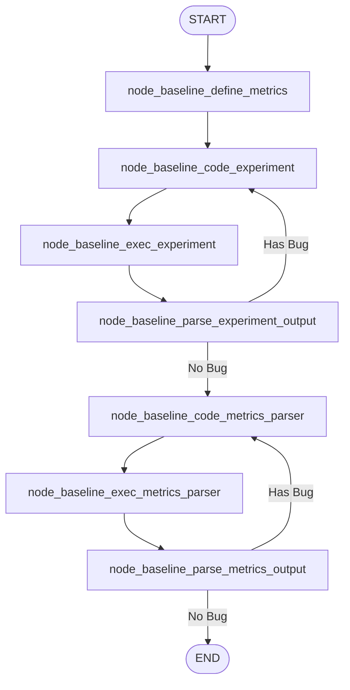
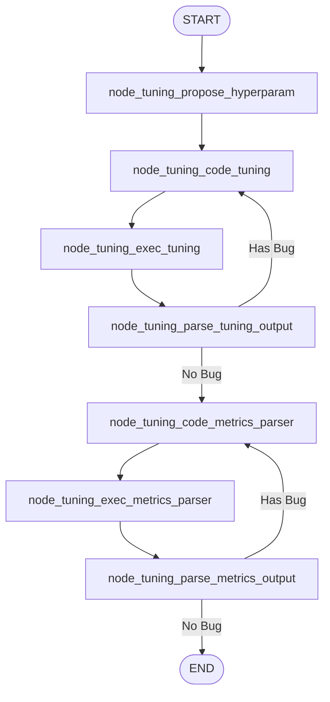
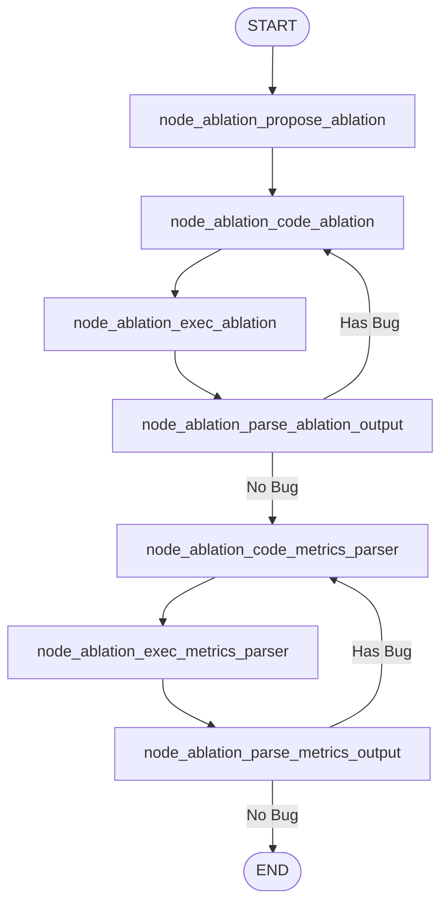
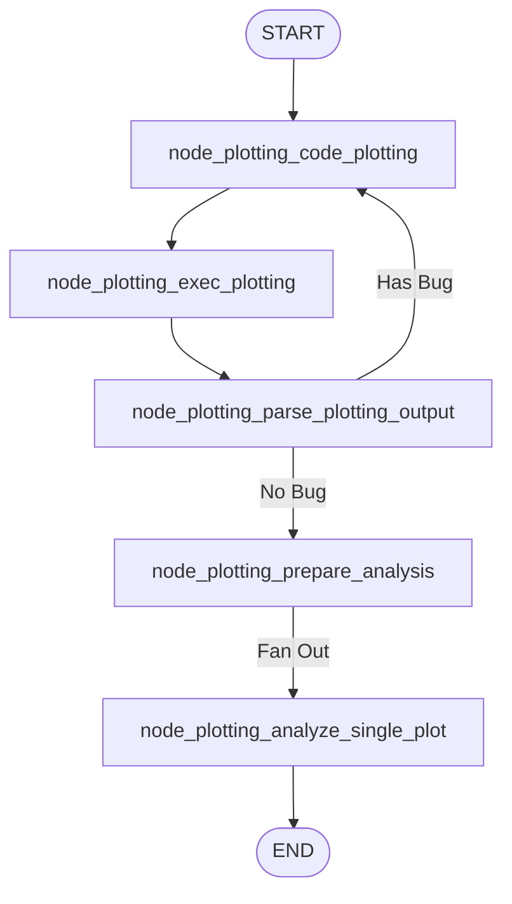
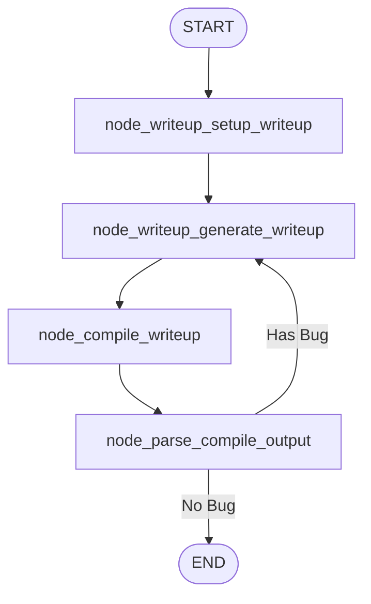

# aigraph

Graph implementation based on [Sakana][1]

## About

Scientific research automation using LangGraph agents.

## Agent Architectures

### 1. Baseline Agent

Defines metrics and runs baseline experiment.

### 2. Tuning Agent

Proposes and tests hyperparameters.

### 3. Ablation Agent

Proposes and runs ablation studies.

### 4. Plotting Agent

Generates and analyzes visualization plots.

### 5. Writeup Agent

Generates and compiles LaTeX document.

[1]: https://github.com/SakanaAI/AI-Scientist