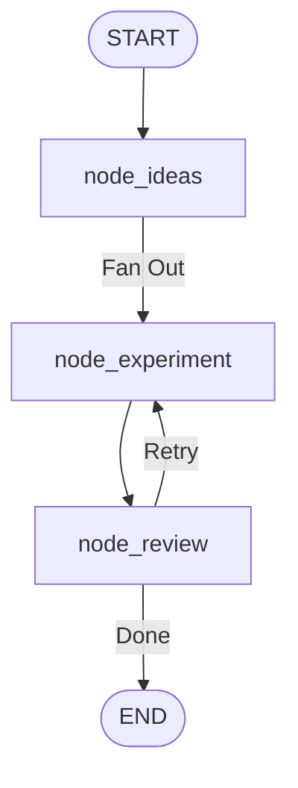
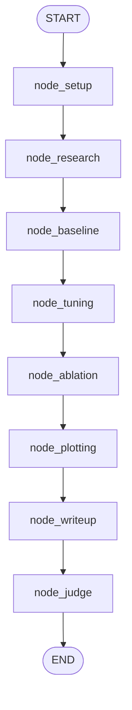
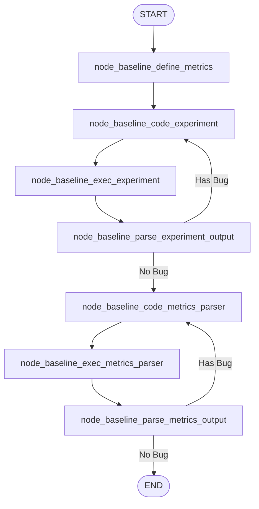
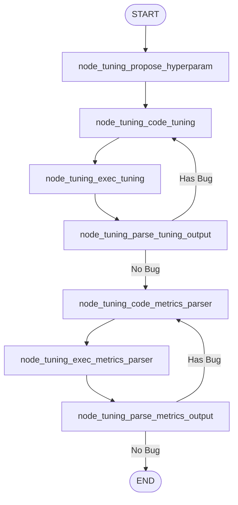
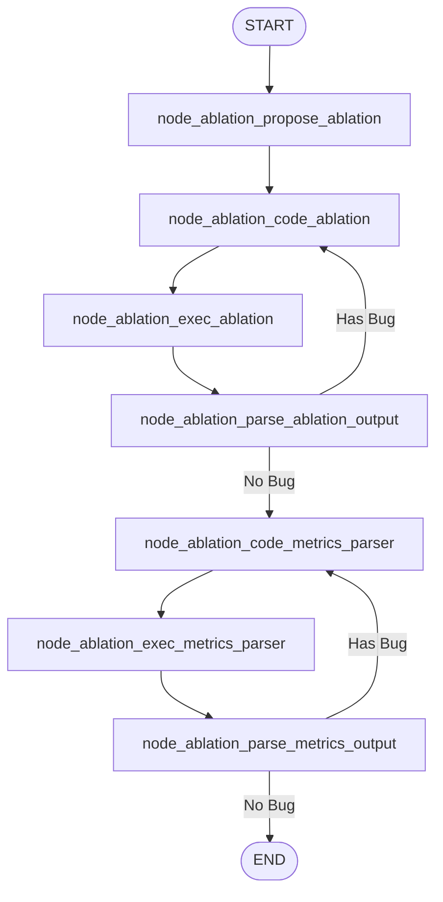
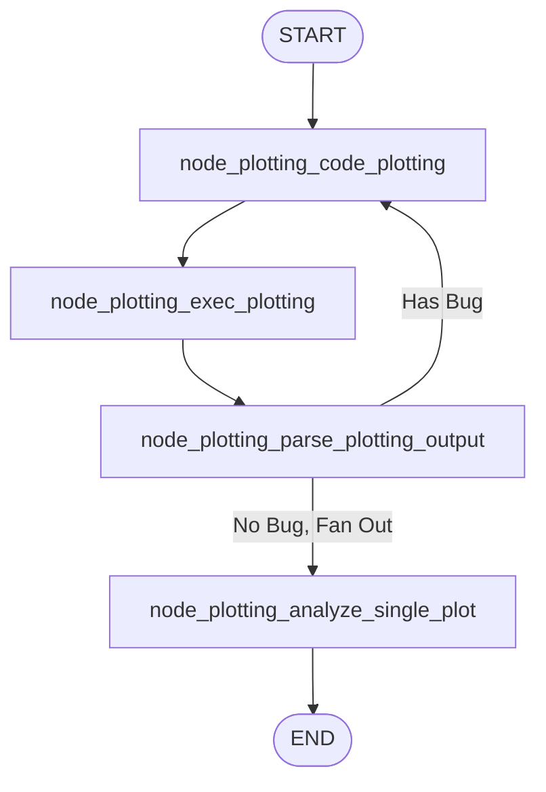
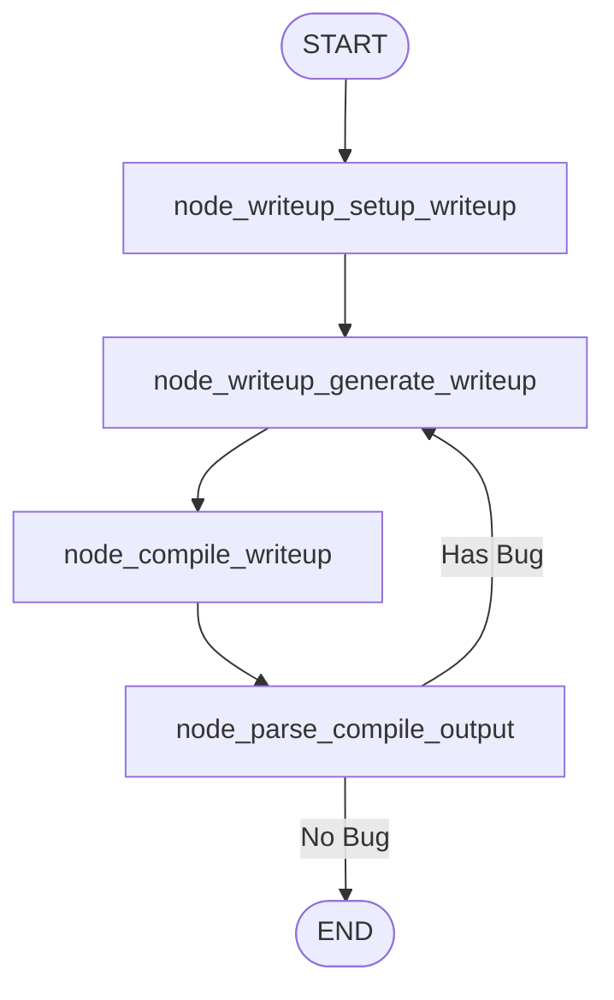

# aigraph

Graph implementation based on [Sakana][1]

## About

Scientific research automation using LangGraph agents.

## Development

### Requirements

- **pdflatex**: Required for LaTeX document compilation
- **chktex**: Required for LaTeX document linting

```bash
sudo apt-get install texlive
# or
brew install --cask mactex 
```

### Setup

```bash
uv sync
```

## Config

Check `.env.example` for the required environment variables.

```bash
# llm. you can use any LLM supported by Langchain
OPENAI_API_KEY=...
ANTHROPIC_API_KEY=...

# Tavily (for research)
TAVILY_API_KEY=...

# Langfuse for tracing
LANGFUSE_TRACING_ENVIRONMENT=...
LANGFUSE_BASE_URL=...
LANGFUSE_SECRET_KEY=...
LANGFUSE_PUBLIC_KEY=...
```

## Running Scripts

Execute individual agents:

- `uv run -m aigraph.scripts.run_baseline` - Define metrics, run baseline
- `uv run -m aigraph.scripts.run_tuning` - Hyperparameter optimization
- `uv run -m aigraph.scripts.run_ablation` - Ablation studies
- `uv run -m aigraph.scripts.run_plotting` - Generate plots and analysis
- `uv run -m aigraph.scripts.run_writeup` - Generate LaTeX document
- `uv run -m aigraph.scripts.run_pipeline` - Execute complete pipeline

## Complete Pipeline (run_pipeline)

Main orchestrator with parallel experiments and review loop:



### Experiment Sub-Graph

Sequential stages within each experiment:



### Pipeline Artifacts & Storage

The pipeline `State.cwd` is the **root directory**. Each experiment receives its
own `cwd` pointing to a unique subdirectory:

```
{root_cwd}/                              # Pipeline's cwd
├── experiment_000_{uuid1}/              # Experiment 1's cwd
│   ├── idea.json
│   ├── state.json
│   ├── research.json
│   ├── data_*.json                      # Metrics files
│   ├── baseline.py                      # Baseline agent
│   ├── baseline_parser.py
│   ├── tuning.py                        # Tuning agent
│   ├── tuning_parser.py
│   ├── ablation.py                      # Ablation agent
│   ├── ablation_parser.py
│   ├── plotting.py                      # Plotting agent
│   ├── *.png                            # Generated plots
│   ├── template.tex                     # Writeup agent
│   └── template.pdf
├── experiment_000_{uuid2}/              # Experiment 2's cwd
│   └── ...
├── experiment_001_{uuid1}/              # Retry of experiment 1
│   └── ...
```

**How `cwd` Flows**:

1. **Pipeline**: `State.cwd` = root directory (e.g., `./output/`)
2. **node_ideas**: Creates `experiment.State.cwd = root_cwd /
   "experiment_{iter}_{uuid}"`
3. **Experiment sub-graph**: All child agents receive the **same experiment
   `cwd`**
4. **All artifacts**: Written to experiment's `cwd`, not root

**Artifacts by Agent**:

| Agent    | Files Generated                                    |
|----------|----------------------------------------------------|
| Pipeline | `idea.json`, `state.json`, `research.json`         |
| Baseline | `baseline.py`, `baseline_parser.py`, `data_*.json` |
| Tuning   | `tuning.py`, `tuning_parser.py`, `data_*.json`     |
| Ablation | `ablation.py`, `ablation_parser.py`, `data_*.json` |
| Plotting | `plotting.py`, `*.png`                             |
| Writeup  | `template.tex`, `template.pdf`                     |

**Naming Convention**:

- Format: `experiment_{iteration:03d}_{uuid}`
- `iteration`: Retry count (000 = first attempt, 001 = first retry)
- `uuid`: Stable identifier per experiment. it keeps the same UUID across
  retries.

## Agent Architectures

### 1. Baseline Agent

Defines metrics and runs baseline experiment.



### 2. Tuning Agent

Proposes and tests hyperparameters.



### 3. Ablation Agent

Proposes and runs ablation studies.



### 4. Plotting Agent

Generates and analyzes visualization plots.



### 5. Writeup Agent

Generates and compiles LaTeX document.



## Concurrency (Fan-Out)

Uses LangGraph's `Send` for parallel execution:

| Location                                          | Pattern | Purpose                                |
|---------------------------------------------------|---------|----------------------------------------|
| `pipeline.node_ideas`                             | Fan-out | Runs multiple experiments in parallel  |
| `pipeline.node_retry`                             | Fan-out | Retries failed experiments in parallel |
| `plotting.node_plotting_should_retry_from_output` | Fan-out | Analyzes each PNG file in parallel     |

Results are aggregated back via reducers (e.g., `Annotated[list[...], op.add]`).

## LangGraph Core Concepts

- **Context**: Runtime config (model settings, max iterations)
- **State**: Graph data with Pydantic models + reducers
- **Checkpointer**: Persists state for fault tolerance/resume

**Project Usage** (from `pipeline.py`):

```python
# Context holds runtime dependencies + configuration
class Context(BaseModel):
    model: str = "gpt-4o-mini"
    max_iterations: int = 3

# State with reducer for aggregation
class State(BaseModel):
    cwd: Path
    task: utils.Task
    experiments: Annotated[list[experiment.State], op.add] = []  # auto-aggregates

# Node accesses context via runtime
async def node_ideas(state: State, runtime: Runtime[Context]) -> list[Send]:
    model = runtime.context.model  # access context
    return [Send("node_experiment", exp_state) for exp_state in experiments]

# Build graph
def build(checkpointer: Checkpointer | None = None):
    builder = StateGraph(state_schema=State, context_schema=Context)
    builder.add_node("node_ideas", node_ideas)
    builder.add_conditional_edges(START, node_ideas, ["node_experiment"])
    return builder.compile(checkpointer=checkpointer)
```

[1]: https://github.com/SakanaAI/AI-Scientist